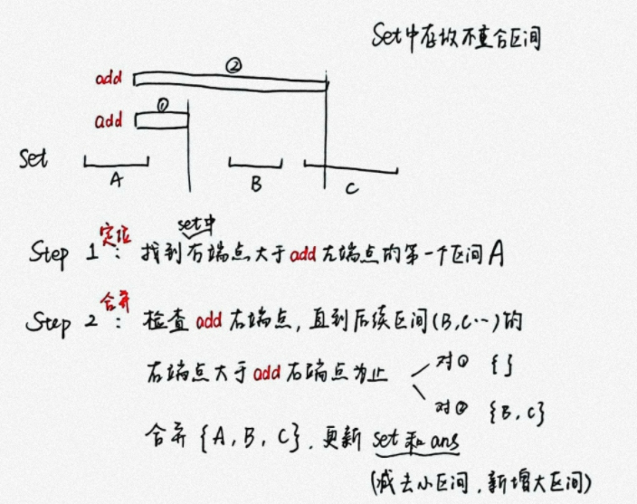

##### 区间合并

> 

###### 0. set
> 如果不会`set`的`lower_bound()`
> 
> set的每个区间元素为`[R, L]`, 方便使用`lower_bound`
> 
> 也可以使用`vector`并始终维护为按**左(右)端点有序** (区间不重合, 所以没分别)


```CPP
set<pair<int, int> > st;
```

###### 1. 定位
> 当加入区间`[left, right]`时，通过`lower_bound`快速找到第一个右端点大等于`left - 1`的区间

```CPP
auto it = st.lower_bound(<pair<int, int> >(left - 1, -2e9));
```

###### 2. 合并
> 不断用接下来的区间和`[left, right]`合并，直到set当前区间的左端点大于`right + 1`

```CPP
while (it != st.end()) {
    // it右边界 > cur右边界时合并终止
    if (it->second > right + 1)
        break;
    L = min(L, it->second);
    R = max(R, it->first);
    ans -= (it->first - it->second + 1);    // 删除参与合并的小区间
    st.erase(it++);
}
ans += (R - L + 1);
```

###### [完整实现](https://leetcode.cn/problems/count-integers-in-intervals/solution/by-tsreaper-fc7p/)