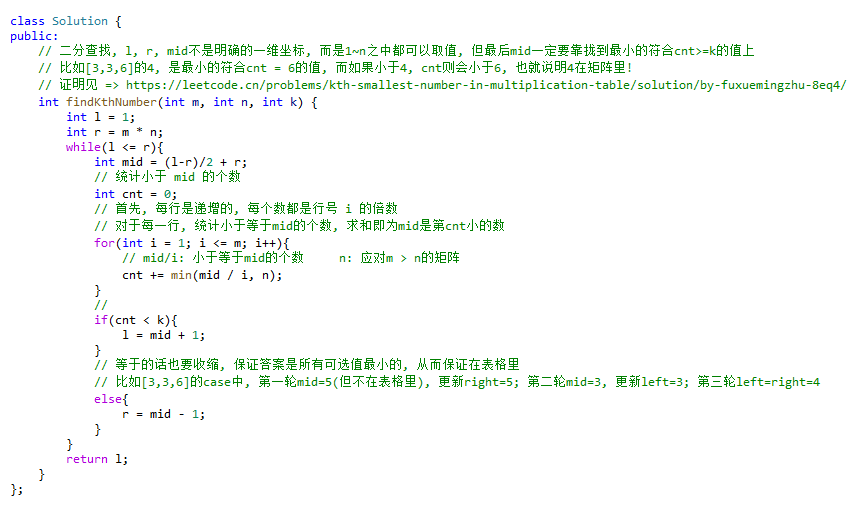

##### 二分法

> 二分查找, l, r, mid不是明确的一维坐标, 而是1~n之中都可以取值, 但最后mid一定要靠拢到最小的符合cnt>=k的值上
> 
> 比如`[3,3,6]`的`4`, 是最小的符合`cnt = 6`的值, 而如果小于4, cnt则会不再大于等于6, 也就说明**4一定在矩阵里**
> 
> https://leetcode.cn/problems/kth-smallest-number-in-multiplication-table/solution/by-fuxuemingzhu-8eq4/
> 
> 

```CPP
int findKthNumber(int m, int n, int k) {
    int l = 1;
    int r = m * n;
    while(l <= r){
        int mid = (l-r)/2 + r;
        // 统计小于 mid 的个数
        int cnt = 0;
        // 首先, 每行是递增的, 每个数都是行号 i 的倍数
        // 对于每一行, 统计小于等于mid的个数, 求和即为mid是第cnt小的数
        for(int i = 1; i <= m; i++){
            // mid/i: 小于等于mid的个数     n: 应对m > n的矩阵
            cnt += min(mid / i, n);
        }
        if(cnt < k){
            l = mid + 1;
        }
        // 等于的话也要收缩, 保证答案是所有可选值中最小的, 从而保证在表格里
        // 比如[3,3,6]的case中, 第一轮mid=5(但不在表格里), 更新right=5; 第二轮mid=3, 更新left=3; 第三轮left=right=4
        else{
            r = mid - 1;
        }
    }
    return l;
}
```

https://leetcode.cn/problems/kth-smallest-number-in-multiplication-table/