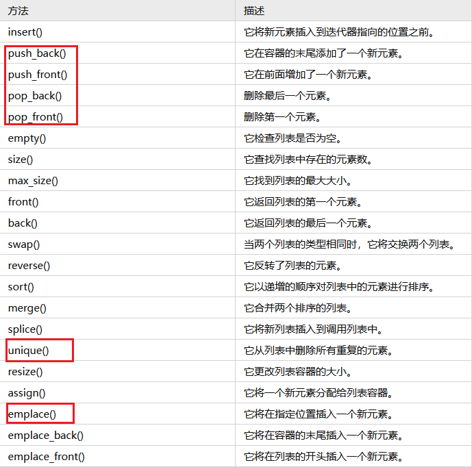

##### vector
> `vi.insert(it, val)`: 在指定位置loc前插入值为val的元素, 返回指向这个元素的迭代器

> `*max_element(vi.begin(), vi.end())`: 求数组最大值

> `v1==v2`: `==`已经重载过, 如果是内置类型的数据, 比如int, char, 可以直接用`v1==v2`来判断

> `accumulate(vi.begin(), vi.end(), 0)`: 第三个参数为**初值**

> 想对某个数组排序, 但不丢失每个元素的原始位置信息, 可以用`pair<int, int>`的形式来保存`{val, idx}`, 然后再`sort()`
> 
> 或者可以单独开一个`vector<int> pos`, 然后定义`sort`的`cmp`方式
```CPP
sort(pos.begin(), pos.end(), [&](int a, int b){
    return vi[a] < vi[b];
})
```


##### string
> `s.substr(start)`: 从`start`截取到末尾
>
> `s.find(ch, start)`: 从`start`开始查找第一次出现位置, 如果找不到返回`s.npos`


##### queue
> `que.insert(it, val)`: 在指定位置loc前插入值为val的元素, 返回指向这个元素的迭代器


##### deque
> 可以在队列的两端进行元素的操作，并且可以高效地在队列的任意位置进行元素的插入和删除操作。
>
> push_back() / emplace_back()
> 
> push_front() / emplace_front()
> 
> pop_back() / pop_front()
> 
> back() / front()
> 
> insert()
> 
> erase()


##### map
> `iterator lower_bound(const key_type &key)`: 返回一个迭代器, 指向键值 >=key 的第一个元素
> 
> `iterator upper_bound(const key_type &key)`: 返回一个迭代器, 指向键值 > key 的第一个元素
>
> `begin()` & `rbegin()` & `end()` & `rend()`: 获取最大值就可以用`mp.rbegin()->first`


##### list 双向链表





##### `prev(iterator)` & `next(iterator)`

> 找到上一个迭代器 ➡️ [示例](https://leetcode.cn/problems/design-a-text-editor/solution/lian-biao-mo-ni-pythonjavacgo-by-endless-egw4/)


##### `algorithm`

> 多个值找最值 ➡️ `min({a, b, c})`
>
> 加大括号表示传入一个容器


##### `multiset`
> `multiset`和`set`的差别在于`multiset`允许键值重复, `set`和`multiset`的底层实现是**红黑树** (因此也是平衡二叉树)。
> 
> `multiset`打破了`set`的互异性, 可以存放多个相同的元素
>
> 
> 
> - `二分`: `set`和`multiset`都可以应用`lower_bound()`, 寻找第一个大于等于某个值的迭代器, 找不到就返回`st.end()`
> 
> - `insert(val)`: 允许集合内存在相同元素
> 
> - `erase`:
>   - `erase(val)`: 值删除, 允许删除该值的所有元素
>   - `erase(iterator)`: 迭代器删除, 只删除迭代器对应的一个元素 (这里可以搭配find使用: `st.erase(st.find(val))`)
>
> - `count(val)`: 返回元素值为`val`的个数
>
> - `begin()` & `rbegin()` & `end()` & `rend()`
>
> e.g. [LC1438. 绝对差不超过限制的最长连续子数组](/workspace/1438.%E7%BB%9D%E5%AF%B9%E5%B7%AE%E4%B8%8D%E8%B6%85%E8%BF%87%E9%99%90%E5%88%B6%E7%9A%84%E6%9C%80%E9%95%BF%E8%BF%9E%E7%BB%AD%E5%AD%90%E6%95%B0%E7%BB%84.cpp)


##### accumulate(st, ed, initial)
> - `st`: 起始迭代器
> - `ed`: 终止迭代器
> - `initial`: 初始值, e.g. `0` or `0L`
```CPP
#include <vector>
#include <numeric>
using namespace std;

vector<int> arr = {1, 2, 3, 4, 5, 6, 7, 8, 9, 10};
int sum = accumulate(arr.begin(), arr.end(), 0);
```

##### next_permutation(st, ed)
> - `st`: 起始迭代器
> - `ed`: 终止迭代器
> - 会在原数组上更改顺序

```CPP
vector<string> arr = {"a", "b", "c"};
next_permutation(arr.begin(), arr.end());
```