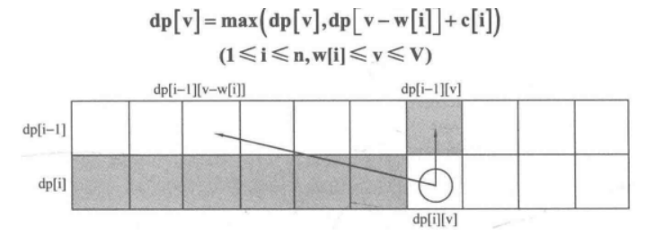

#### 0-1背包

##### 1. 问题定义
> 
> `C`：背包容量
> 
> `n`：物品数量
> 
> `weight[]`: n个item的重量
> 
> `value[]`: n个item的价值
> 
> 二维dp[i][j]: 前i个items放入容量为j的背包所得到的最大价值
>
> 一维dp[j]: 倒序进行对容量C的遍历, 将二维数组压缩到一维


##### 2. 状态转移方程
```
dp[i][j] = max(dp[i - 1][j], dp[i - 1][j - weight[i]] + value[i])

(1) 容量j为0时, dp[i][0] = 0
(2) 对于item 0, dp[0][j] = (j>=weight[0])?value[0]:0
```


##### 3. 二维dp实现
```CPP
int zero_one_bag(){
    int dp[n][C+1];
    // 初始化
    for(int i=0; i<n; i++){
        dp[i][0] = 0;
    }
    for(int j=0; j<=C; j++){
        dp[0][j] = (j>=weight[0]) ? value[0] : 0;
    }
    // 状态转移
    for(int i=1; i<n; i++){
        for(int j=0; j<=C; j++){
            if(j>=weight[i])
	            dp[i][j] = max(dp[i-1][j-weight[i]]+value[i], dp[i-1][j]);	// max{放jth, 不放jth}
            else
                dp[i][j] = dp[i-1][j];
        }
    }
    return dp[n-1][C];
}
```


##### 4. 一维滚动数组（从右向左）

> 

```CPP
int zero_one_bag(){
    // 初始化
    for(int j=0; j<=C; j++){
        dp[j] = 0;
    }
    // 状态转移
    for(int i=0; i<n; i++){
        // 倒序遍历 C, 可以截止到weight[i]
        for(int j=C; j>=weight[i]; j--){
            dp[j] = max(dp[j], dp[j-weight[i]]+value[i]);
        }
    }
    return dp[C];
}
```


##### 半数求和 / 目标和

[LC416. 分割等和子集](/workspace/416.%E5%88%86%E5%89%B2%E7%AD%89%E5%92%8C%E5%AD%90%E9%9B%86.cpp)

[LC1049. 最后一块石头的重量](/workspace/1049.%E6%9C%80%E5%90%8E%E4%B8%80%E5%9D%97%E7%9F%B3%E5%A4%B4%E7%9A%84%E9%87%8D%E9%87%8F-ii.cpp)

[📌LC494. 目标和](/workspace/494.%E7%9B%AE%E6%A0%87%E5%92%8C.cpp)


##### 二维dp
[📌LC474. 一和零](/workspace/474.%E4%B8%80%E5%92%8C%E9%9B%B6.cpp)
