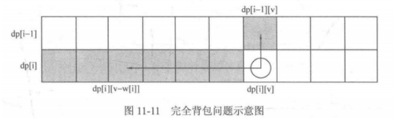

#### 完全背包

**如果求组合数就是外层for循环遍历物品，内层for遍历背包容量**。

**如果求排列数就是外层for遍历背包容量，内层for循环遍历物品**。


##### 1. 一维滚动数组



```CPP
// 先遍历物品，再遍历背包
int complete_bag() {
    vector<int> weight = {1, 3, 4};
    vector<int> value = {15, 20, 30};
    int C = 4;
    vector<int> dp(C + 1, 0);
    // 遍历物品
    for(int i = 0; i < weight.size(); i++) {
        // 与0-1背包的区别：容量递增
        for(int j = weight[i]; j <= C; j++) {
            dp[j] = max(dp[j], dp[j - weight[i]] + value[i]);
        }
    }
    return dp[C];
}
```


##### 零钱兑换
> 注意dp[i]的含义可能根据题意有所不同, 但是完全背包的本质是相同的

[LC322. 零钱兑换](/workspace/322.%E9%9B%B6%E9%92%B1%E5%85%91%E6%8D%A2.cpp)

[LC518. 零钱兑换Ⅱ](/workspace/518.%E9%9B%B6%E9%92%B1%E5%85%91%E6%8D%A2-ii.cpp)

[LC279. 完全平方数](/workspace/279.%E5%AE%8C%E5%85%A8%E5%B9%B3%E6%96%B9%E6%95%B0.cpp) => 零钱面额是`1, 4, 9, ···`


##### 求组合数
>求组合数就是外层for循环遍历物品，内层for遍历背包容量

[LC518. 零钱兑换Ⅱ](/workspace/518.%E9%9B%B6%E9%92%B1%E5%85%91%E6%8D%A2-ii.cpp)


##### 求排列数
> 外层for遍历背包容量，内层for循环遍历物品

[LC377. 组合总和Ⅳ](/workspace/377.%E7%BB%84%E5%90%88%E6%80%BB%E5%92%8C-%E2%85%B3.cpp)

[LC70. 爬楼梯(改编为排列)](https://programmercarl.com/0070.%E7%88%AC%E6%A5%BC%E6%A2%AF%E5%AE%8C%E5%85%A8%E8%83%8C%E5%8C%85%E7%89%88%E6%9C%AC.html#%E6%80%9D%E8%B7%AF)

[📌LC139. 单词拆分](/workspace/139.%E5%8D%95%E8%AF%8D%E6%8B%86%E5%88%86.cpp) - 为什么好像组合不行?