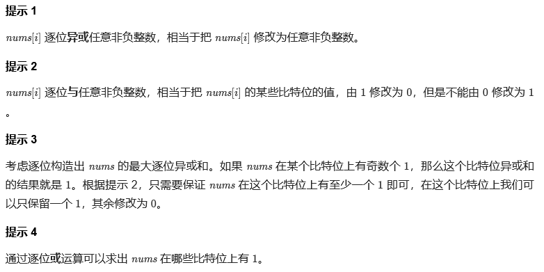

### Biweek 2

#### Biweek 2

#### 1. 统计星号

> 设置`flag`标记是否将"*"计入
```CPP
int countAsterisks(string s) {
    int cnt = 0;
    int lineNum = 0;
    for(int i=0; i<s.size(); i++){
        if(s[i]=='|'){
            lineNum++;
            continue;
        }
        if(s[i]=='*'){
            if(lineNum % 2 == 0){
                cnt++;
            }
        }
    }
    return cnt;
}
```


##### 2. 统计无向图中无法互相到达点对数
> 总体上求连通分量个数及size
> 实现上如果用[并查集](../markdown/%E4%B8%93%E9%A2%98%20-%20%E5%B9%B6%E6%9F%A5%E9%9B%86.md)会超时, 所以要用BFS...

```CPP
vector<vector<int> > e;
vector<bool> vis;

int bfs(int S) {
    int ret = 0;    // 当前连通分量节点数
    queue<int> q;
    q.push(S);
    vis[S] = true;
    while (!q.empty()) {
        ret++;
        int sn = q.front(); q.pop();
        for (int fn : e[sn]){
            if (!vis[fn]) 
                q.push(fn);
            vis[fn] = true;
        }
    }
    return ret;
}

long long countPairs(int n, vector<vector<int>>& edges) {
    e.resize(n, vector<int>());
    vis.resize(n, false);
    for (auto &edge : edges) {
        e[edge[0]].push_back(edge[1]);
        e[edge[1]].push_back(edge[0]);
    }
    long long ans = 0;
    for (int i = 0; i < n; i++){
        if (!vis[i]) {
            int t = bfs(i);
            ans += 1LL * t * (n - t);   // 当前连通分量节点数 * 其余节点数
        }
    }
    return ans / 2;
}
```


##### 3. 操作后的最大异或和()



```CPP
int maximumXOR(vector<int>& nums) {
    // 有1的bit位上结果可取1
    int ans = 0;
    for(int n: nums){
        ans |= n;
    }
    return ans;
}
```