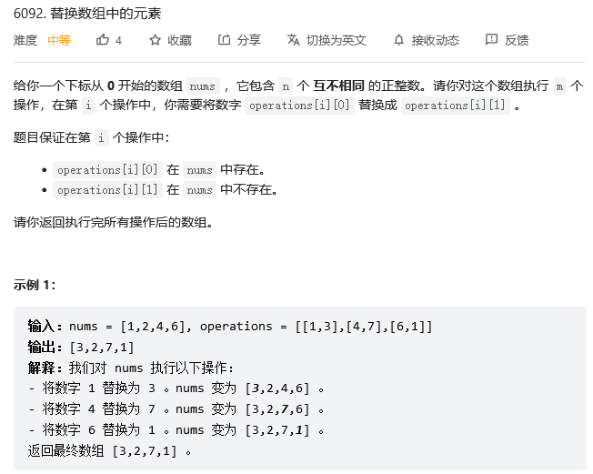

#### Weekly 1

##### 1. 极大极小游戏 (9min)
> [题目](https://leetcode.cn/problems/min-max-game/)
> 
> 间隔取最大/最小, 直到只剩下一个元素
> 
> 因为总数为2^k, 因此不需要考虑边界, 循环直到剩下最后一个
> 
> 存储上, 每一层只用到前一层的结果, 因此直接在`nums`上覆盖即可

```CPP
int minMaxGame(vector<int>& nums) {
    int n = nums.size();    // 2的幂次
    while(n > 1){
        vector<int> newNum(n/2);
        for(int i=0; i<n/2; i++){
            if(i%2==1)
                nums[i] = max(nums[2*i], nums[2*i+1]);
            else
                nums[i] = min(nums[2*i], nums[2*i+1]);
        }
        n/=2;
    }
    return nums[0];
}
```


##### 2. 划分数组使最大差为 K
> [题目](https://leetcode.cn/problems/partition-array-such-that-maximum-difference-is-k/)
>
> 将nums划分成多个子序列, 使nums中的每个元素都恰好出现在一个子序列中
>
> 在满足每个子序列中`最大值和最小值之间的差值最多为 k `的前提下, 返回需要划分的最少子序列数目
> 
> 题目多少有点坑人, 这题和子序列关系大吗...需要维持什么顺序...
> 
> 先对nums排序, 然后从头至尾, 一旦`right-left > k`, 则说明需要一次分割

```CPP
int partitionArray(vector<int>& nums, int k) {
    sort(nums.begin(), nums.end());
    int cnt = 1;
    int start = nums[0];
    for(int i=0; i<nums.size(); i++){
        if(abs(nums[i]-start) > k){
            cnt++;
            start = nums[i];
        }
    }
    return cnt;
}
```

##### 3. 替换数组中的元素 (12min)

> [题目](https://leetcode.cn/problems/replace-elements-in-an-array/)
> 
> 
> 
> 题目保证元素互不相同, 使用`map`维护元素值出现的位置, 每次替换后更新`map`即可
> 
> 吸取前几次的教训, 多跑了一次用例才提交...

```CPP
vector<int> arrayChange(vector<int>& nums, vector<vector<int>>& operations) {
    // 元素 <-> 位置映射
    unordered_map<int, int> mp;
    for(int i=0; i<nums.size(); i++){
        mp[nums[i]] = i;
    }
    for(int i=0; i<operations.size(); i++){
        if(mp.find(operations[i][0])!=mp.end()){
            nums[mp[operations[i][0]]] = operations[i][1];
            // 修改映射
            cout<<operations[i][1]<< " -> "<<mp[operations[i][0]]<<endl;
            mp[operations[i][1]] = mp[operations[i][0]];
        }
    }
    return nums;
}
```


##### 4. 设计一个文本编辑器

> 68/75, `string`存储文本, 截取用`substr`的方式导致的超时, 有点无能为力
> 
> 题解一般使用`LinkList` or `双栈`来存储
> 
> 浩翔哥说是直接用string会有太多`内存移位`, 导致超时

```CPP
class TextEditor {
public:
    /* 双栈 */
    stack<char> left, right;
    TextEditor() {

    }
    
    void addText(string text) {
        for(char ch: text)
            left.push(ch);
    }
    
    int deleteText(int k) {
        int popped = min(k, int(left.size()));
        for(int i=0; i<popped; i++){
            left.pop();
        }
        return popped;
    }
    
    string cursorLeft(int k) {
        // 这一段是真正的cursor移动, 即重新划分left, right
        k = min(k, int(left.size()));
        for(int i=0; i<k; i++){
            right.push(left.top());
            left.pop();
        }
        // 这里是假的pop, 只是为了取min(10, cursor)这段字符串, 还要push回去
        string ans = "";
        for(int i=0; i<10 && left.empty()==false; i++){
            ans += left.top();
            left.pop();
        }
        for(int i=ans.size()-1; i>=0; i--){
            left.push(ans[i]);
        }
        reverse(ans.begin(), ans.end());
        return ans;
    }
    
    string cursorRight(int k) {
        // 这一段是真正的cursor移动, 即重新划分left, right
        k = min(k, int(right.size()));
        for(int i=0; i<k; i++){
            left.push(right.top());
            right.pop();
        }
        // 这里是假的pop, 只是为了取min(10, cursor)这段字符串, 还要push回去
        string ans = "";
        for(int i=0; i<10 && left.empty()==false; i++){
            ans += left.top();
            left.pop();
        }
        for(int i=ans.size()-1; i>=0; i--){
            left.push(ans[i]);
        }
        reverse(ans.begin(), ans.end());
        return ans;
    }
};
```
